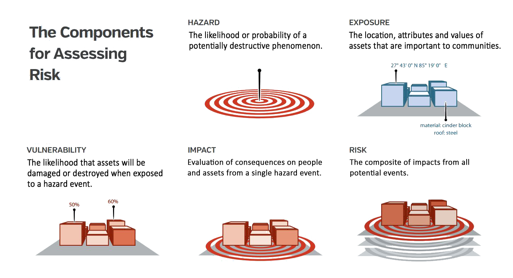

# Key concepts

## What is risk data

The foundation of Disaster Risk Management is understanding and measuring the hazard phenomena, the people and asset exposed to these hazards and their vulnerability. The quantification of risks allows governments, communities, and individuals to take informed decisions to anticipate the potential impacts of hazards.
A disaster risk assessment provides a foundation for long-term engagement and investment focused on reducing existing risk and avoiding the creation of new risk. Appropriate communication of robust risk information at the right time can raise awareness and trigger action to reduce risk. 

(adapted from "Understanding in risk in an evolving world, World Bank, 2014")

Explain in detail how the concepts above links to the components of the RDL, in particular explain how "loss" component is related to risk.

 
## Risk data examples

Visual examples?
Diagram

```mermaid
graph TD
A[Data] --> B[Database]
B --> C[User1]
B --> D[User2]
```

 
## Risk Terminology

Definitions from glossary (only risk-related)

## Background documentation

on the main website or other sources

 
