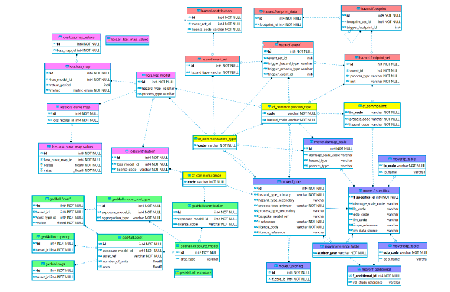

# DATABASE SCHEMA OVERVIEW

high-level simplified UML-style diagram that focuses on the core relationships between entities, rather than listing all of their attributes. This helps to put the various entities in context. 
a description of how the key elements of the model fit together, with pointers to the detailed sections

The Risk DB schema includes four components:

- **Hazard** DB schema: describes hazard scenario footprints and return period hazard maps 
- **Exposure** DB schema: describes exposed assets and population
- **Vulnerability** DB schema: describes physical vulnerbaility, fragility and damage-to-loss models
- **Loss** DB schema: describes modelled damage and losses produced in a risk assessment

Below is a simplified entity-relationship diagram of the whole database schema. All tables are shown but only key fields are included in each table.

ERD for Risk Data schema including all components (Hazard, Exposure, Vulnerability and Loss). Yellow = common tables; Red = hazard tables; Green = Exposure tables; Purple = vulnerability tables; Violet = loss table.